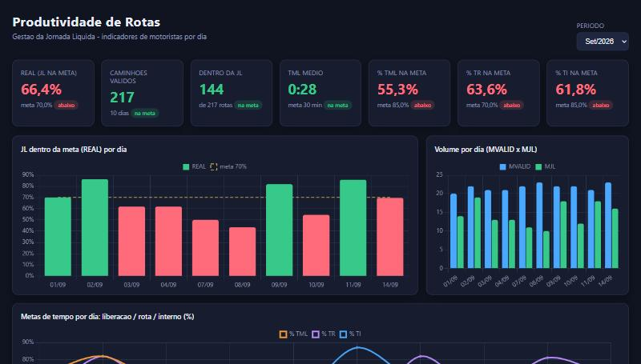

# Produtividade de Rotas

Sistema de análise de produtividade de motoristas e ajudantes de entrega. Ele
cruza os dados de roteirização (2 ART) com o espelho de ponto usando o CPF como
chave, calcula os indicadores de jornada por rota e por dia e entrega três
produtos de dados: um **dashboard de BI web interativo**, um **data warehouse em
SQLite** (modelo estrela) e um **painel self-service dentro do Excel**.

O objetivo de negócio é responder, todo dia, três perguntas sobre cada rota:
o motorista foi **liberado rápido**, ele **rodou a rota no tempo** e ele teve um
**tempo interno curto** ao voltar. Tudo isso rola com apenas dois arquivos de
entrada e sem instalar banco de dados nenhum.



Dashboard web interativo (Chart.js), gerado pelo pipeline a partir do data
warehouse e publicável no GitHub Pages. O mesmo modelo de dados também alimenta
um painel dentro do Excel (`docs/dashboard.png`).

## Como funciona (pipeline de dados)

O fluxo segue as etapas clássicas de um pipeline analítico:

```
  Extract            Transform                Load                 Serve
  -------            ---------                ----                 -----
  2 ART (CSV/xlsx)   cruzamento por CPF       modelo estrela       dashboard web (BI)
  espelho de ponto   indicadores por rota     (SQLite)             painel Excel (BI)
  (xlsx)             regras de negocio        qualidade de dados   CSV + views SQL de KPI
```

1. **Extract** (`jornada_liquida.py`): leitura tolerante do 2 ART (CSV posicional
   ou Excel disfarçado, com datas em número de série e horas em fração do dia) e
   do espelho de ponto (relatório em blocos por colaborador).
2. **Transform**: normalização de CPF, junção 2 ART -> cadastro -> colaborador ->
   ponto, e cálculo dos indicadores em `indicadores_rota()` (fonte única de regra,
   usada tanto pelo Excel quanto pelo warehouse).
3. **Load** (`warehouse.py`): gravação em um modelo estrela no SQLite.
4. **Serve**: dashboard de BI web (`bi_web.py`, Chart.js), painel interativo no
   Excel (`dashboard_excel.py`) e exportação das dimensões, do fato e das views
   de KPI em CSV para qualquer ferramenta de BI.

## Indicadores e regras

Cada rota gera três tempos, medidos a partir do cruzamento com o ponto real:

| Indicador | O que mede | Cálculo | Meta |
|-----------|------------|---------|------|
| **TML** | tempo de liberação | saída do caminhão menos entrada no ponto | <= 30 min |
| **TR**  | tempo em rota | chegada menos saída do caminhão | <= 09:20 |
| **TI**  | tempo interno | saída do ponto menos chegada do caminhão | <= 30 min |
| **JL**  | jornada líquida total | TML + TR + TI | <= 10:20 |

A partir deles, o painel mostra por dia: **MVALID** (rotas válidas), **MJL**
(rotas dentro da JL), **REAL** (MJL / MVALID, meta 70%), a média de TML e os
percentuais de TML, TR e TI dentro da meta, além de recortes por dia da semana e
por semana do mês.

## Modelo de dados (star schema)

O warehouse usa um modelo dimensional simples (`sql/schema.sql`):

- `dim_calendario`: uma linha por dia, com ano, mês, trimestre, dia da semana e
  semana ISO já derivados.
- `dim_colaborador`: motorista/ajudante, com o **CPF mascarado** (governança de
  PII: só os 3 primeiros e 2 últimos dígitos ficam visíveis).
- `fato_jornada`: grão de uma rota por colaborador por dia, com as medidas em
  minutos e as flags de meta (val_jl, bate_jl, val_tml, bate_tml, tr_ok, ti_ok).
- `vw_kpi_diario` e `vw_kpi_mensal`: views que reproduzem os KPIs do painel em
  SQL (`sql/views.sql`).

## Qualidade de dados

Todo carregamento roda um conjunto de checagens (`warehouse.py`) e grava o
resultado na tabela `dq_resultados`: percentual de colaboradores com CPF válido,
rotas sem ponto casado, chaves duplicadas (dia + colaborador), integridade
referencial do fato, valores fora de faixa e cobertura do período. Cada checagem
recebe status `OK` ou `ALERTA`.

## Como executar

Requisitos: Python 3.10+ e as dependências de `requirements.txt`
(`openpyxl`; `pywin32` no Windows, opcional, para o painel interativo).

```bash
pip install -r requirements.txt

# 1) gera os dados de exemplo (100% sinteticos)
python exemplos/gerar_dados_exemplo.py

# 2) pipeline de dados: gera o data warehouse (SQLite) + CSVs para BI
python warehouse.py --2art exemplos/2art_exemplo.csv --ponto exemplos/ponto_exemplo.xlsx --saida-db warehouse.db

# 3) gera o dashboard de BI web a partir do warehouse (abre docs/index.html no navegador)
python bi_web.py --db warehouse.db --saida docs/index.html

# ou a interface grafica: cadastros salvos + geracao do relatorio Excel
python app.py
```

A interface gráfica guarda os cadastros localmente, então no dia a dia basta
informar os dois arquivos do período (2 ART e espelho de ponto) para gerar o
relatório com o painel e o warehouse juntos.

## Estrutura do projeto

```
app.py                 Interface grafica (Tkinter): cadastros + geracao
jornada_liquida.py     Extract + Transform + regra de negocio (indicadores)
dashboard_excel.py     Painel de BI interativo dentro do Excel (COM/openpyxl)
warehouse.py           Load em modelo estrela (SQLite) + qualidade + export CSV
bi_web.py              Dashboard de BI web (Chart.js) gerado do warehouse
armazenamento.py       Persistencia local dos cadastros
sql/                   DDL do modelo estrela e views de KPI (documentacao)
exemplos/              Gerador de dados sinteticos + arquivos de exemplo
docs/                  Dashboard web (index.html) e imagens da documentacao
```

## Stack

Python (stdlib: `sqlite3`, `csv`, `tkinter`, `argparse`), `openpyxl` para Excel,
`pywin32` para automação COM do painel interativo. Modelagem dimensional
(Kimball), SQL analítico e verificações de qualidade de dados.

## Privacidade

Este repositório não contém nenhum dado real. Os cadastros e os arquivos de
exemplo são gerados de forma sintética (CPFs fictícios começando em `900...`),
e no warehouse os CPFs ficam mascarados.
